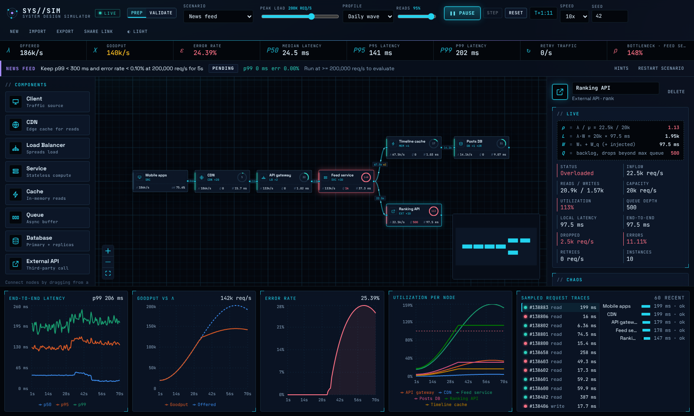

# SimLoad

A system design simulator. Simulate how a system architecture behaves under traffic from **1 req/s up to
100M req/s** ("earth scale"), entirely in your browser. Draw a design, turn up
the load, and watch queues build, latency climb, caches save you and retry
storms take you down.

Use it for **system-design interview prep** (built-in scenarios with pass/fail
goals) and for **validating real architectures** (calibrate nodes from measured
latency and capacity).

**Live demo:** https://simload.webappslab.com/



## Features

**Model**

- **Components:** Client, CDN, Load Balancer, Service, Cache, Queue, Database
  (primary, read replicas, shards with hot-key skew) and External API. Each has
  capacity, instances, a latency distribution, pool size, queue limit, timeout,
  retries, hit ratio, autoscaling, cold starts and cost.
- **Routing:** edges carry a weight and a traffic class (all, reads or
  writes), so you can model CQRS-style splits. Load balancers health-check
  their targets and route around dead ones.
- **Resilience:** circuit breakers, retry budgets, exponential backoff with
  jitter, rate limiting with load shedding, and availability zones.
- **Hybrid simulation engine:** a rate-based flow layer (M/M/c queueing,
  backlogs, drops, timeouts, retry amplification) plus a sampled-request layer
  for p50/p95/p99 and request traces. It is deterministic for a given seed.
- **Traffic:** a log-scale slider from 1 to 100M req/s; steady, daily wave,
  flash spike and ramp profiles; adjustable read/write ratio.

**Analysis**

- **Insights:** a plain-language bottleneck explainer, e.g. "Links DB is
  overloaded (ρ = 10): add 15 read replicas, or a cache would cut its load to
  21.8k/s". It also flags retry storms, timeouts, single-zone risk and
  headroom.
- **Capacity planner:** finds the leanest instances, replicas, shards or
  consumers that meet a goal with at least 10% headroom, then applies the plan
  in one click (and one undo step).
- **Cost model:** instance-hours plus per-million-request pricing, shown live
  per component. Scenario goals can include a monthly budget.
- **Calculator:** back-of-the-envelope estimates (daily users → QPS, storage,
  bandwidth) that can set the traffic directly.

**Practice and validation**

- **Nine scenarios** from warm-up to advanced: URL shortener, video CDN, news
  feed, chat system, search typeahead, ticket flash sale, API rate limiting,
  payment processing, and multi-region failover with a scripted zone outage.
  Each has a goal with pass/fail feedback, hints that unlock as you fail, and
  a tested reference solution.
- **Validation mode:** calibrate a node from measured p50/p99 and capacity, or
  import load-test results: k6 (summary or JSON output), Gatling
  `simulation.log`, JMeter JTL or plain CSV.

**Live view and chaos**

- Nodes are coloured by utilisation with ρ gauges, edges carry flow particles,
  and live charts show latency, goodput, errors and utilisation, with a trace
  waterfall.
- **Replay:** pause and scrub back through a run; the canvas shows each node's
  state at that moment.
- **Compare runs:** save up to four runs and overlay p99, p50, goodput or
  error rate.
- **Chaos:** kill a node or a whole zone, add latency, flush a cache, or
  trigger a retry storm.

**Editing and sharing**

- Descriptions on every component and connection (purpose, behaviour, what
  flows over a link), shown in a hover card on the canvas and included in
  reports. All built-in scenarios come described.
- Undo/redo, copy/paste/duplicate and one-click layered auto-layout.
- Import from SimLoad JSON, Mermaid flowcharts or draw.io files. Component
  kinds are inferred from labels and shapes.
- Export JSON, a Markdown report, or a printable PDF report with an
  architecture diagram, charts and findings.
- Autosave, plus compressed share links that carry the design in the URL hash.
- **Flexible workspace:**
  - Resizable, collapsible panels; focus mode with `F`.
  - Zoom, fit and minimap controls sit in a toolbar above the canvas.
- Opens straight into the URL shortener scenario with a 3‑2‑1 countdown, then
  starts the simulation. "Explore first" stays paused, and "Restore my last
  design" brings back your own previous work. Shared links open their design
  instead.
- Dark ("mission control") theme by default, with a light theme one click away.
- 100% client-side: no backend, no accounts.

### Keyboard shortcuts

| Keys                                        | Action                                        |
| ------------------------------------------- | --------------------------------------------- |
| `Ctrl/⌘ Z` / `Ctrl/⌘ Shift Z` (or `Ctrl Y`) | Undo / redo                                   |
| `Ctrl/⌘ C` / `V` / `D`                      | Copy, paste, duplicate the selected component |
| `Delete` / `Backspace`                      | Delete the selection                          |
| `F`                                         | Focus mode (hide all panels)                  |
| `[` / `]` / `\`                             | Toggle palette / inspector / charts           |

## Quick start

Requirements: Node 22 (see `.nvmrc`) and pnpm 10 (`corepack enable`).

```bash
pnpm install
pnpm dev          # http://localhost:5173
```

## Scripts

| Command        | What it does                                                  |
| -------------- | ------------------------------------------------------------- |
| `pnpm dev`     | Start the Vite dev server for the web app                     |
| `pnpm test`    | Run the Vitest suites (engine and web)                        |
| `pnpm check`   | Format check, lint, typecheck and test, as CI runs them       |
| `pnpm build`   | Build the engine and the production web app (`apps/web/dist`) |
| `pnpm preview` | Serve the production build locally                            |
| `pnpm format`  | Format everything with Prettier                               |

## Deploying

Every push to `main` runs `.github/workflows/deploy.yml`, which builds the app
and publishes it to GitHub Pages at the custom domain
[simload.webappslab.com](https://simload.webappslab.com/). The domain is set in
the repository's Pages settings and points at GitHub Pages via a DNS `CNAME`
record.

The workflow builds with `VITE_BASE=/` because a custom domain serves the site
from the root. Without `VITE_BASE`, `vite.config.ts` derives the base path from
the repository name (`/<repo>/`) for `https://<owner>.github.io/<repo>/`. Pages
must use **GitHub Actions** as its source.

`.github/workflows/ci.yml` runs format check, lint, typecheck, tests and build on
every push and pull request.

## Project layout

```
packages/engine   Pure TypeScript simulation engine (no DOM), Vitest tests
apps/web          Vite + React app (React Flow, Zustand, Recharts, Web Worker)
docs/             Requirements, architecture and ADRs
```

Read more in [docs/architecture.md](docs/architecture.md),
[docs/requirements.md](docs/requirements.md) and the ADRs in [docs/adr](docs/adr).
Contributions are welcome; see [CONTRIBUTING.md](CONTRIBUTING.md).

## Using the engine directly

```ts
import { createDesign, createEdge, createNode, createSimulation } from '@simload/engine';

const design = createDesign(
  'demo',
  [createNode('client', 'client'), createNode('api', 'service', undefined, { instances: 4 })],
  [createEdge('client', 'api')],
  { peakRps: 5_000 },
);
const sim = createSimulation(design, { seed: 7 });
const tick = sim.run(100); // 10 simulated seconds
console.log(tick.latency.p99, tick.errorRate, tick.nodes.api?.queueDepth);
```

## License

[MIT](LICENSE)
